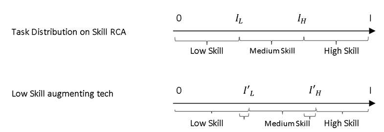
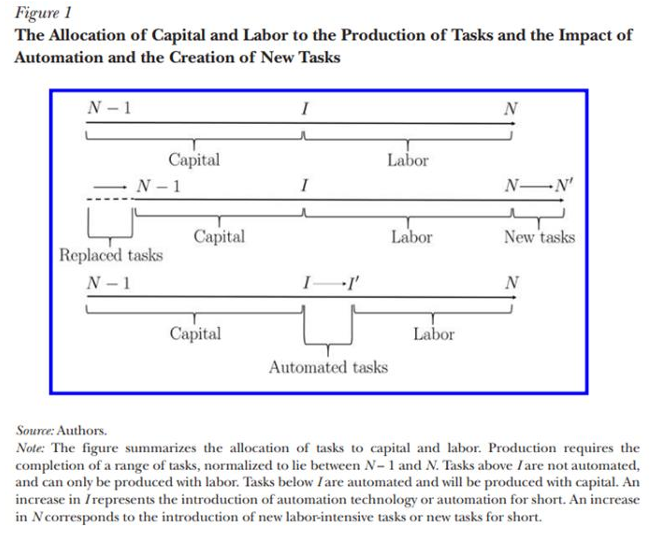
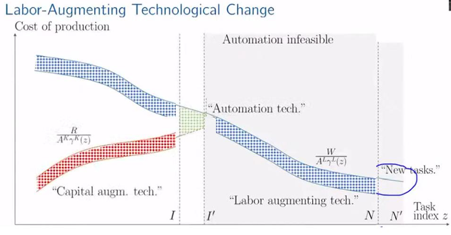

# Job Complexity and Price Indexes: A Theoretical Framework and Empirical Application

## Abstract

This paper presents an enhanced theoretical framework for understanding job complexity and price indexes across different geographic levels. Building on the economic complexity literature and labor market theories, we integrate multiple theoretical approaches to develop a comprehensive model that captures the relationship between skills, tasks, and economic outcomes. We validate our framework against empirical data and propose methodological improvements to address identified limitations. The paper concludes with applications for creating job complexity and price indexes at country, state, and metropolitan levels, with implications for policy and future research on technological change and labor markets.

## 1. Introduction

The relationship between skills, tasks, and economic outcomes has been a central focus in labor economics and economic development literature. Recent advances in economic complexity theory have provided new tools for understanding these relationships, particularly through network approaches that capture relatedness between economic activities. This paper builds on these advances to develop an integrated framework for measuring job complexity and creating price indexes that can inform policy and research.

The labor market has undergone significant transformations due to technological change, globalization, and shifting skill demands. Understanding these dynamics requires frameworks that can capture the multidimensional nature of jobs and tasks, as well as their evolution over time. Traditional approaches often struggle to account for the hidden variables of skills and skill intensity that underlie observed patterns of employment and wages.

Our approach leverages the economic complexity framework to address these challenges, applying dimensionality reduction techniques to infer hidden capabilities from observed patterns of employment and wages. We extend existing models to incorporate individual skills rather than broad skill levels, allowing for more nuanced analysis of comparative advantage in labor markets.

The paper is structured as follows: Section 2 reviews the relevant literature, highlighting key theoretical frameworks and empirical findings. Section 3 presents our integrated theoretical model, combining elements from Ricardo-Roy, Acemoglu-Restrepo, and economic complexity frameworks. Section 4 critically validates the model against empirical evidence and identifies limitations. Section 5 proposes methodological improvements to address these limitations. Section 6 outlines applications for creating job complexity and price indexes at different geographic levels. Section 7 concludes with implications for policy and future research.

## 2. Literature Review

### 2.1 Ricardo-Roy Model: Comparative Advantage of Workers Based on Skill

The Ricardo-Roy model provides a foundation for understanding how tasks are allocated among workers with different skill levels. Using a Cobb-Douglas production function, the model represents job output in terms of tasks and skill levels (low, medium, and high). The model uses comparative advantage to determine which tasks are allocated to which skill levels, and examines how changes in productivity affect wages and labor composition.

The Cobb-Douglas Labor Aggregate is represented as:

$$
Y = B \times L^{I_L} M^{I_H - I_L} H^{I - I_H}
$$
Where B (aka TFP) is given by 
$$
B = \exp\left(\int_{0}^{I_L} \ln A_l \, \alpha(i) \, di + \int_{I_L}^{I_H} \ln A_m \, \alpha(i) \, di + \int_{I_H}^{I} \ln A_h \, \alpha(i) \, di\right)
$$

### 2.2 Acemoglu-Restrepo Model: Capital Replacement vs Technology Replacement 

This model provides insights into how technological change affects different skill levels, but is limited by its focus on broad skill categories rather than individual skills.

$$
Y(L, K) = \left[ \left( \int_{N-1}^{I} \gamma^K(z)^{\sigma-1} dz \right)^{1/\sigma} (A^K K)^{(\sigma-1)/\sigma} + \left( \int_{I}^{N} \gamma^L(z)^{\sigma-1} dz \right)^{1/\sigma} (A^L L)^{(\sigma-1)/\sigma} \right]^{\sigma/(\sigma-1)}
$$

The Acemoglu-Restrepo model extends the analysis to consider the allocation of tasks between capital and labor. Using the elasticity of substitution (σ) between capital and labor, the model examines how technological change affects productivity and task allocation. The aggregate production function is given by:

The model identifies four key forces at play in technological change:
1. Automation at the extensive margin (displacement)
2. Automation at the intensive margin
3. Labor-augmenting technological advances
4. Creation of new tasks

This framework provides valuable insights into how technology affects labor markets, but assumes a constant elasticity of substitution and doesn't fully account for institutional factors. The authors evaluate impact of technology on labor augmentation, (Blue), Capital Augmentation 
(Red), displacement (Green), Creation of new tasks. (Acemogulu, 2018)

### 2.3 Economic Complexity Framework

The economic complexity framework, developed by Hausmann, Hidalgo, and colleagues, provides tools for understanding the hidden capabilities that underlie economic activities. Originally applied to export patterns, the framework has been extended to labor markets to analyze skill relatedness and labor flows.

The framework uses network analysis to identify patterns of relatedness between industries or occupations, inferring the presence of shared capabilities. These patterns can then be used to predict future growth and diversification based on existing capabilities.

Recent work by O'Clery and others has applied these methods to labor markets, using labor flows to identify skill-related clusters of industries. This approach has shown promise in predicting employment growth and identifying opportunities for workforce development.

### 2.4 Implied Comparative Advantage

Building on the economic complexity framework, recent research has developed the concept of implied comparative advantage. This approach uses correlations between observed patterns of production to infer hidden information about the requirements of industries and the endowments of locations.

The implied comparative advantage can then be compared to observed patterns to identify potential areas for growth or diversification. Empirical evidence suggests that deviations between observed and implied comparative advantage are predictive of future growth, especially over longer time horizons.

This approach has been applied to various contexts, including international exports and subnational employment patterns, demonstrating its versatility and predictive power.

## 3. Integrated Theoretical Model

### 3.1 Job and Task Complexity Index

Expanding the Ricardo Roy Model to Individual Skills instead of Skill Levels (See 
Illustration), which translate to productivity in completing a task. Considering average skill 
composition of a job to be the worker’s average skill composition and intensity. 

#### Assumption 1: Lets assume a perfectly competitive labor market (Wage is equal to value add) where a worker in Job $𝐽_𝑗$ is paid a wage $𝜔_𝑗$ for completing a set of tasks $𝜏_{𝑗−1}$ .. $𝜏_𝑗$
 
Let 𝜏𝑖 represent the value add by single unit of task, and 𝑁𝑗𝑖 represent number of unit of 
task performed in Job 𝐽𝑗. Then Wage is given by

$$
\omega_j = \sum_i \tau_i N_{ji}
$$

Let the worker take time $l_{ji}$ to complete $N_{ji}$, and normalize $l_{ji}$ such that:

$$
\sum_i l_{ji} = 1 \quad \text{for all } j
$$

We define productivity $A_{ji}$ as the number of task units completed per unit of time:

$$
A_{ji} = \frac{N_{ji}}{l_{ji}}
$$

Without loss of generalization, let $𝜏_𝑖 = 1 ∀𝑖, 𝑁_{𝑗𝑖}$ represents the value added by Task i in Job j, 

$$
\omega_𝑗 = \sum_i 𝑁_{𝑗𝑖} = \sum_i 𝑙_{𝑗𝑖} × 𝐴_{𝑗𝑖} 
$$

**Revealed Comparative Advantage:** If a worker in Job $j$ is working on multiple tasks, the worker will choose tasks that provide maximum wage. On average, workers will choose tasks in which they are most productive. For a given worker in Job $J_1$ looking at tasks $t_1$ and $t_2$, the worker will choose task $t_1$ if $A_{j, t_1} > A_{j, t_2}$.

#### Assumption 2: In a perfectly competitive labor market, assuming every worker works as productively as possible across multiple tasks, the productivity of a worker in job $j$ will be equal for all tasks the worker is performing.

$$
\implies A_{ji} = A_{jk} = A_j    ∀ j
$$

$$
\omega_j = \sum_i N_{ji} = \sum_i l_{ji} \times A_{ji}
$$

$$
A_ji = N_ji/l_ji
$$

Revealed Comparative Advantage: If a worker in Job j is working on multiple tasks, the worker will choose tasks that provide maximum wage. On average, workers will choose tasks in which they are most productive. For a given worker in Job J1 looking at tasks t1 and t2, the worker will choose task t1 if A_(j,t1) > A_(j,t2).
$$
C_j = \frac{1}{k_j} \sum_i M_{ji} C_i
$$
$$
C_i = \frac{1}{k_i} \sum_j M_{ji} C_j
$$

Where:
- $C_j$ is the complexity of job $j$
- $C_i$ is the complexity of task $i$
- $M_{ji}$ is the binary matrix indicating whether job $j$ performs task $i$
- $k_j$ is the diversity of job $j$ (number of tasks)
- $k_i$ is the ubiquity of task $i$ (number of jobs performing it)
1. Diversity: The number of different tasks performed in a job
2. Ubiquity: How common each task is across different jobs

We then use an iterative method to refine these measures, accounting for the complexity of the tasks themselves:

$$
\mathrm{RCA}_{lo} = \frac{E_{lo}/\sum_o E_{lo}}{\sum_l E_{lo}/\sum_l \sum_o E_{lo}}
$$

Where $E_{lo}$ is the employment in location $l$ and occupation $o$.

We then use the patterns of co-occurrence across locations and occupations to infer the implied comparative advantage:

$$
\mathrm{ICA}_{lo} = \sum_{o'} \varphi_{oo'} \mathrm{RCA}_{lo'}
$$

Where $\varphi_{oo'}$ is a measure of relatedness between occupations $o$ and $o'$.

The deviation between observed and implied comparative advantage can then be used to predict future growth:

$$
\mathrm{Growth}_{lo} = \beta (\mathrm{ICA}_{lo} - \mathrm{RCA}_{lo}) + \text{controls} + \varepsilon_{lo}
$$

Building on the concept of implied comparative advantage, we develop a measure for labor markets that captures the potential for growth or specialization in different occupations.

We define the Revealed Comparative Advantage (RCA) of a location l in occupation o as:

$$
RCA_lo = (E_lo/∑_o E_lo)/(∑_l E_lo/∑_l∑_o E_lo)
$$

Where E_lo is the employment in location l and occupation o.

We then use the patterns of co-occurrence across locations and occupations to infer the implied comparative advantage:

$$
ICA_lo = ∑_o' φ_oo' RCA_lo'
$$

Where φ_oo' is a measure of relatedness between occupations o and o'.

The deviation between observed and implied comparative advantage can then be used to predict future growth:

$$
Growth_lo = β(ICA_lo - RCA_lo) + controls + ε_lo
$$

This framework allows us to identify potential areas for growth or specialization based on the existing pattern of comparative advantages.

## 4. Critical Validation

### 4.1 Strengths of the Integrated Model

Our integrated model has several key strengths:

1. **Comprehensive Framework**: By combining elements from multiple theoretical approaches, the model provides a more complete picture of labor market dynamics.

2. **Novel Application of Complexity Methods**: The application of economic complexity tools to labor markets allows for the analysis of hidden variables that are difficult to measure directly.

3. **Empirical Testability**: The model generates specific predictions about wages, employment growth, and occupational structure that can be tested against empirical data.

4. **Scalability**: The framework can be applied at different geographic levels, from countries to metropolitan areas, allowing for comparative analysis.

5. **Policy Relevance**: The insights from the model can inform workforce development policies and strategies for addressing technological change.

### 4.2 Limitations and Weaknesses

Despite its strengths, our model has several limitations that must be acknowledged:

1. **Data Limitations**: The model relies heavily on wage data as a proxy for productivity, which may not fully capture non-wage factors affecting job value.

2. **Simplifying Assumptions**: The assumption of perfect competition in labor markets is unrealistic in many contexts, and the model may not adequately account for institutional factors.

3. **Methodological Concerns**: Dimensionality reduction techniques might lose important nuances in skill relationships, and complexity measures are sensitive to data quality and classification systems.

4. **Technological Change Modeling**: The current impact estimates of innovation on higher vs. lower complexity tasks show significant but low impact, suggesting the model may not fully capture the effects of technological change.

5. **Validation Gaps**: The model needs further validation across multiple wage deciles and against external mobility data.

### 4.3 Empirical Evidence

Empirical evidence provides mixed support for the model:

1. **Wage Patterns**: Wage data shows correlation with complexity measures, but with significant unexplained variance.

2. **Employment Growth**: The implied comparative advantage measure shows predictive power for employment growth, especially over longer time horizons.

3. **Technological Impact**: The impact of innovation differs for higher vs. lower complexity tasks, but the effect size is smaller than expected.

4. **Labor Mobility**: Job mobility patterns only partially align with the model's predictions about comparative advantage.

## 5. Methodological Improvements

Based on the critical validation, we propose several methodological improvements to address the identified limitations:

### 5.1 Relaxing Perfect Competition Assumption

We propose incorporating models of imperfect competition in labor markets, accounting for institutional factors in wage determination, and modeling firm-specific practices and their impact on productivity. This can be achieved by introducing market power parameters and allowing for wage premiums that deviate from marginal productivity.

### 5.2 Enhancing Dynamic Elements

We recommend developing explicit models of skill acquisition and depreciation over time, incorporating learning curves and experience effects, and modeling the co-evolution of tasks and technologies. This would involve extending the static framework to a dynamic setting with explicit temporal dimensions.

### 5.3 Improving Empirical Testability

To strengthen empirical validation, we suggest specifying more precise, testable hypotheses, identifying natural experiments or instrumental variables for causal identification, and developing standardized measures that can be applied across different contexts.

### 5.4 Strengthening Micro-Macro Connections

We propose developing multi-level models that connect individual decisions to aggregate outcomes, specifying feedback mechanisms between macro conditions and micro behaviors, and accounting for general equilibrium effects in labor markets.

### 5.5 Incorporating Institutional Context

The model should be extended to account for the role of education and training systems, labor market regulations and policies, and cultural factors affecting skill valuation and job preferences.

### 5.6 Refining Complexity Metrics

We recommend developing task-specific complexity measures, accounting for skill complementarities and substitutabilities, and incorporating measures of task novelty and innovation potential.

## 6. Applications for Index Creation

### 6.1 Country-Level Job Complexity and Price Indexes

The framework can be applied to create job complexity and price indexes at the country level, using national labor market data. These indexes would provide insights into the relative complexity of different economies and the returns to different types of skills.

For each country, we would:
1. Collect data on occupational employment and wages
2. Calculate complexity measures for each occupation
3. Aggregate to create a national job complexity index
4. Calculate price indexes based on wage data and complexity measures
5. Compare across countries to identify patterns and trends

### 6.2 State and Metropolitan Level Indexes

The same approach can be applied at subnational levels, creating indexes for states and metropolitan areas. These more granular indexes would provide insights into regional variations in job complexity and returns to skills.

The methodology would be similar to the country-level approach, but would require more detailed data on local labor markets. The resulting indexes would allow for analysis of how job complexity varies within countries and how it relates to regional economic outcomes.

### 6.3 Visualization Approaches

Drawing inspiration from the Harvard Atlas of Economic Complexity, we propose several visualization approaches for the job complexity and price indexes:

1. **Treemap Visualizations**: Hierarchical displays of occupational structure, color-coded by complexity or wage levels.

2. **Job Space Networks**: Network visualizations showing the relatedness between different occupations based on skill overlap.

3. **Geographic Maps**: Spatial representations of job complexity and price indexes across different regions.

4. **Time Series Charts**: Visualizations of how job complexity and prices have evolved over time.

These visualizations would make the complex data more accessible and facilitate insights into patterns and trends.

## 7. Conclusion and Future Directions

This paper has presented an integrated theoretical framework for understanding job complexity and price indexes, combining elements from multiple theoretical approaches and applying economic complexity methods to labor markets. We have critically validated the framework, identified limitations, and proposed methodological improvements to address these limitations.

The framework provides a foundation for creating job complexity and price indexes at different geographic levels, with applications for policy and research. These indexes can inform workforce development strategies, educational planning, and responses to technological change.

Future research should focus on implementing the proposed methodological improvements, collecting more granular data on tasks and skills, and developing more sophisticated visualization approaches. Additionally, the framework could be extended to incorporate emerging technologies like artificial intelligence and their potential impacts on labor markets.

By advancing our understanding of job complexity and its relationship to economic outcomes, this research contributes to both theoretical knowledge and practical applications in labor economics and economic development.

## References

[To be completed with full citations from the reviewed literature]
